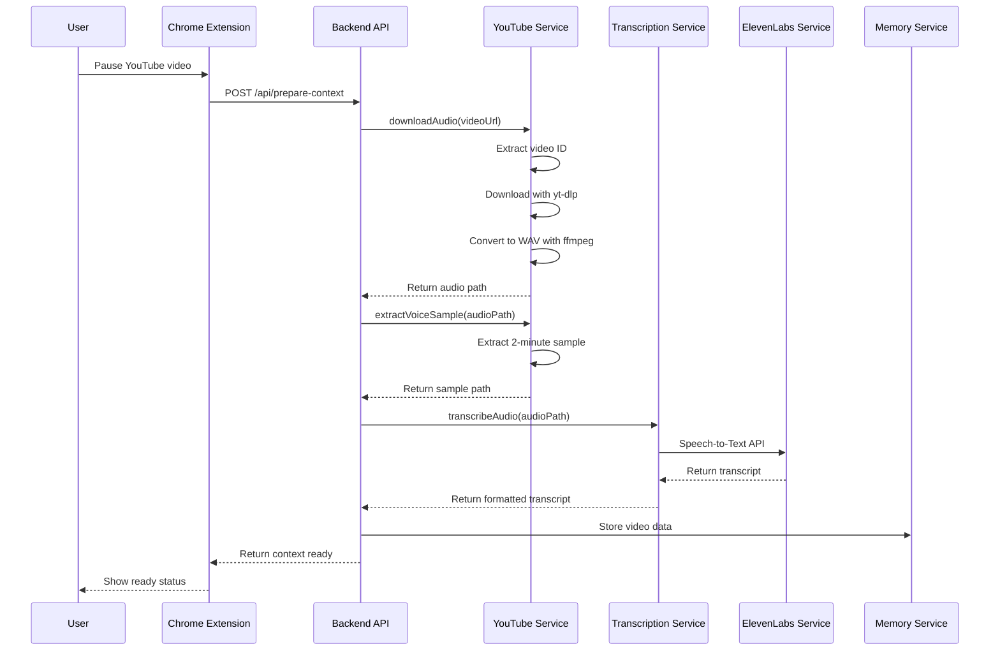
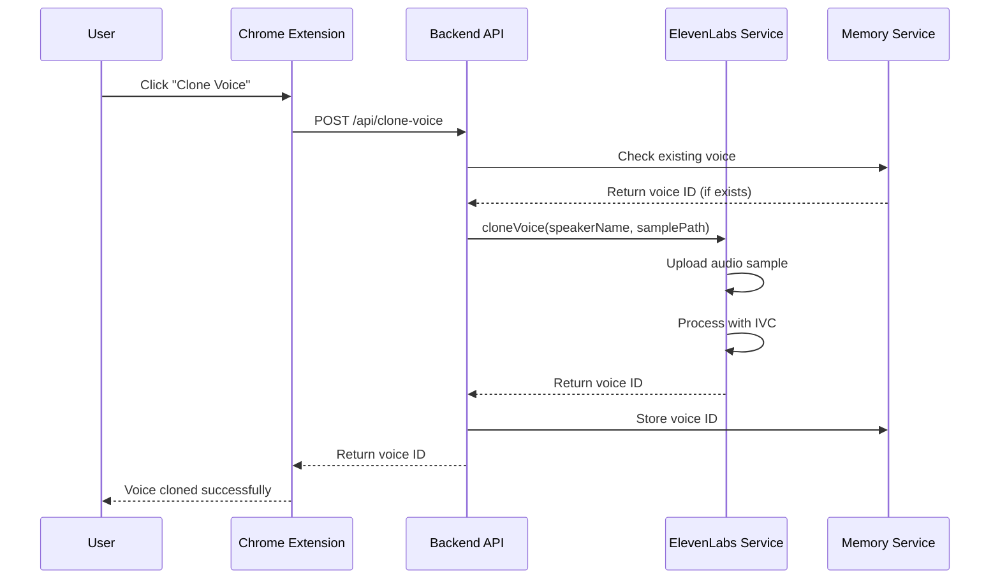
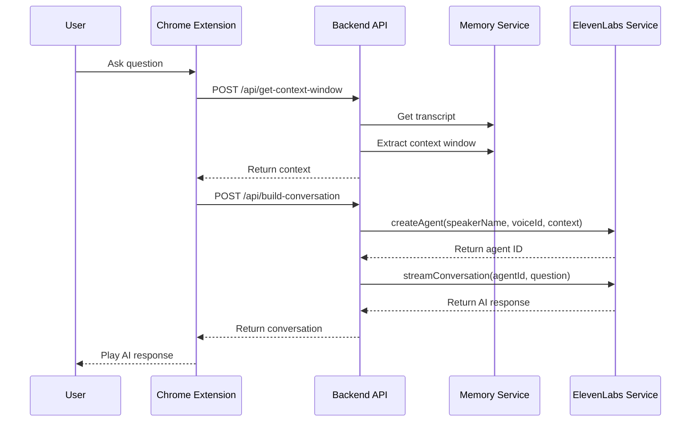

# VoxTube System Design

## 🏗️ System Architecture Overview

VoxTube is a real-time AI-powered conversation system that enables users to have voice conversations with YouTube video speakers using cloned voices and conversational AI.

```
┌─────────────────────────────────────────────────────────────────────────────────┐
│                                    VoxTube System Architecture                  │
├─────────────────────────────────────────────────────────────────────────────────┤
│                                                                                 │
│  ┌─────────────────┐    ┌─────────────────┐    ┌─────────────────┐             │
│  │   Chrome        │    │   YouTube       │    │   User          │             │
│  │   Extension     │◄──►│   Video         │◄──►│   Interface     │             │
│  └─────────────────┘    └─────────────────┘    └─────────────────┘             │
│           │                       │                       │                     │
│           │                       │                       │                     │
│           ▼                       ▼                       ▼                     │
│  ┌─────────────────────────────────────────────────────────────────────────────┐ │
│  │                           Backend API Server                                │ │
│  │  ┌─────────────┐ ┌─────────────┐ ┌─────────────┐ ┌─────────────┐           │ │
│  │  │   YouTube   │ │Transcription│ │ ElevenLabs  │ │   Memory    │           │ │
│  │  │   Service   │ │   Service   │ │   Service   │ │   Service   │           │ │
│  │  └─────────────┘ └─────────────┘ └─────────────┘ └─────────────┘           │ │
│  └─────────────────────────────────────────────────────────────────────────────┘ │
│           │                       │                       │                     │
│           ▼                       ▼                       ▼                     │
│  ┌─────────────────┐    ┌─────────────────┐    ┌─────────────────┐             │
│  │   yt-dlp        │    │   ElevenLabs    │    │   In-Memory     │             │
│  │   + ffmpeg      │    │   API           │    │   Cache         │             │
│  └─────────────────┘    └─────────────────┘    └─────────────────┘             │
│                                                                                 │
└─────────────────────────────────────────────────────────────────────────────────┘
```

## 🔄 Core Workflow

### 1. Video Processing Pipeline



### 2. Voice Cloning Pipeline



### 3. Conversation Pipeline



## 🏛️ Component Architecture

### Backend Services

#### 1. YouTube Service (`src/services/youtube.ts`)
```typescript
class YouTubeService {
  // Core functionality
  extractVideoId(url: string): string
  downloadAudio(videoUrl: string): Promise<{audioPath, videoId}>
  extractVoiceSample(audioPath: string): Promise<string>
  cleanup(filePath: string): Promise<void>
}
```

**Responsibilities:**
- Extract video IDs from YouTube URLs
- Download audio using yt-dlp
- Convert audio formats using ffmpeg
- Extract voice samples for cloning
- Manage temporary file cleanup

**Dependencies:**
- `yt-dlp` for video downloading
- `ffmpeg` for audio processing
- File system for temporary storage

#### 2. Transcription Service (`src/services/transcription.ts`)
```typescript
class TranscriptionService {
  // Core functionality
  transcribeAudio(audioPath: string): Promise<TranscriptSegment[]>
  getContextWindow(transcript: TranscriptSegment[], pausedTime: number): string
  private requestTranscription(audioPath: string): Promise<any>
  private formatTranscript(apiResponse: any): TranscriptSegment[]
}
```

**Responsibilities:**
- Convert audio to text using ElevenLabs STT
- Format transcript with timestamps
- Extract context windows for conversations
- Handle API timeouts and errors

**Dependencies:**
- ElevenLabs Speech-to-Text API
- FormData for file uploads
- Node-fetch for HTTP requests

#### 3. ElevenLabs Service (`src/services/elevenlabs.ts`)
```typescript
class ElevenLabsService {
  // Core functionality
  cloneVoice(name: string, audioPath: string): Promise<string>
  generateSpeech(voiceId: string, text: string): Promise<Buffer>
  createAgent(speakerName: string, voiceId: string, contextWindow: string): Promise<string>
  streamConversation(agentId: string, userQuestion: string): Promise<StreamConversationResponse>
  buildConversationConfig(voiceId: string, speakerName: string, contextWindow: string, userQuestion: string): ConversationConfig
}
```

**Responsibilities:**
- Clone speaker voices using Instant Voice Cloning (IVC)
- Generate speech with cloned voices
- Create conversational AI agents
- Handle real-time streaming conversations
- Manage voice settings and configurations

**Dependencies:**
- ElevenLabs Voice Cloning API
- ElevenLabs Text-to-Speech API
- ElevenLabs Conversational AI API
- WebSocket for streaming

#### 4. Memory Service (`src/services/memory.ts`)
```typescript
class MemoryService {
  // Core functionality
  setVideoData(videoId: string, data: VideoData): void
  getVideoData(videoId: string): VideoData | undefined
  setVoiceId(videoId: string, voiceId: string): void
  getVoiceId(videoId: string): string | undefined
  cacheContextWindow(videoId: string, pausedTime: number, context: string): void
  getCachedContextWindow(videoId: string, pausedTime: number): string | undefined
  incrementQuestionCount(videoId: string): void
  getQuestionCount(videoId: string): number
  cleanup(): void
}
```

**Responsibilities:**
- Cache video transcripts and metadata
- Store voice IDs and speaker information
- Cache context windows for performance
- Track question limits per video
- Manage memory cleanup and expiration

**Dependencies:**
- In-memory storage (Map/Set)
- Timer for cleanup operations

### API Layer (`src/routes/api.ts`)

#### Endpoints Overview

```typescript
// Core API endpoints
POST /api/prepare-context     // Extract video transcript and voice sample
POST /api/clone-voice         // Clone speaker voice with ElevenLabs
POST /api/get-context-window  // Get transcript context for timestamp
POST /api/build-conversation  // Build conversation config for AI
POST /api/speak              // Generate speech with cloned voice
GET  /api/health             // Service health check
```

#### Request/Response Flow

```typescript
// Example: Prepare Context Flow
interface PrepareContextRequest {
  videoUrl: string;
}

interface PrepareContextResponse {
  videoId: string;
  transcriptReady: boolean;
  voiceSampleUrl: string;
}

// Validation → Processing → Response
router.post('/prepare-context', async (req, res) => {
  // 1. Validate request
  const validation = prepareContextSchema.safeParse(req.body);
  
  // 2. Check cache
  const existingData = memoryService.getVideoData(videoId);
  
  // 3. Process if not cached
  const { audioPath } = await youtubeService.downloadAudio(videoUrl);
  const voiceSamplePath = await youtubeService.extractVoiceSample(audioPath);
  const transcript = await transcriptionService.transcribeAudio(audioPath);
  
  // 4. Store in memory
  memoryService.setVideoData(videoId, { transcript, voiceSampleUrl });
  
  // 5. Return response
  res.json({ videoId, transcriptReady: true, voiceSampleUrl });
});
```

## 🔧 Configuration & Environment

### Environment Variables
```env
# Core Configuration
ELEVENLABS_API_KEY=your_api_key_here
PORT=3001
NODE_ENV=development

# Application Settings
MAX_QUESTIONS_PER_VIDEO=25
CACHE_DURATION_HOURS=24
MAX_CONTEXT_WINDOW_SECONDS=60

# FFmpeg Configuration
FFMPEG_PATH=D:\Development\ffmpeg-7.1.1-essentials_build\bin\ffmpeg.exe
FFPROBE_PATH=D:\Development\ffmpeg-7.1.1-essentials_build\bin\ffprobe.exe
```

### Configuration Schema (`src/config/index.ts`)
```typescript
const configSchema = z.object({
  PORT: z.string().default('3001'),
  NODE_ENV: z.enum(['development', 'production', 'test']).default('development'),
  ELEVENLABS_API_KEY: z.string().min(1, 'ElevenLabs API key is required'),
  MAX_QUESTIONS_PER_VIDEO: z.string().default('25'),
  CACHE_DURATION_HOURS: z.string().default('24'),
  MAX_CONTEXT_WINDOW_SECONDS: z.string().default('60'),
  FFMPEG_PATH: z.string().optional(),
  FFPROBE_PATH: z.string().optional(),
});
```

## 🛡️ Security & Performance

### Security Features
- **Rate Limiting**: 100 requests per 15 minutes per IP
- **Input Validation**: Comprehensive Zod schemas
- **CORS Protection**: Configured for Chrome extension origins
- **Helmet Security**: Standard web security headers
- **Error Handling**: Secure error responses without sensitive data

### Performance Optimizations
- **In-Memory Caching**: Fast access to processed data
- **Context Window Caching**: Pre-computed context for timestamps
- **File Cleanup**: Automatic removal of temporary files
- **Optimized Audio Settings**: 16kHz mono for faster processing
- **Request Timeouts**: 5-minute timeout for transcription requests

### Memory Management
```typescript
// Cache structure
interface VideoData {
  transcript?: TranscriptSegment[];
  voiceSampleUrl?: string;
  voiceSamplePath?: string;
  voiceId?: string;
  agentId?: string;
  speakerName?: string;
  questionCount?: number;
  createdAt: Date;
}

// Cleanup strategy
- Auto-cleanup after 24 hours
- Question count tracking
- Temporary file management
- Memory usage monitoring
```

## 🔄 Data Flow Architecture

### 1. Video Processing Data Flow
```
YouTube URL → Video ID → Audio Download → Voice Sample → Transcript → Cache
     ↓           ↓           ↓              ↓            ↓         ↓
   Validation  Extraction  yt-dlp        ffmpeg      ElevenLabs  Memory
```

### 2. Voice Cloning Data Flow
```
Voice Sample → ElevenLabs IVC → Voice ID → Memory Cache → Response
     ↓              ↓              ↓           ↓           ↓
   Audio File    API Upload    Processing   Storage    Client
```

### 3. Conversation Data Flow
```
User Question → Context Window → Agent Creation → AI Response → Voice Generation
     ↓              ↓              ↓              ↓              ↓
   Input        Transcript      ElevenLabs    LLM Processing  TTS Output
```

## 🚀 Deployment Architecture

### Development Environment
```
┌─────────────────┐    ┌─────────────────┐    ┌─────────────────┐
│   Chrome        │    │   Node.js       │    │   External      │
│   Extension     │◄──►│   Backend       │◄──►│   APIs          │
│   (Local)       │    │   (Local:3001)  │    │   (ElevenLabs)  │
└─────────────────┘    └─────────────────┘    └─────────────────┘
```

### Production Environment
```
┌─────────────────┐    ┌─────────────────┐    ┌─────────────────┐
│   Chrome        │    │   Load          │    │   ElevenLabs    │
│   Extension     │◄──►│   Balancer      │◄──►│   API           │
│   (Distributed) │    │   (Cloud)       │    │   (External)    │
└─────────────────┘    └─────────────────┘    └─────────────────┘
                              │
                              ▼
                       ┌─────────────────┐
                       │   Backend       │
                       │   Instances     │
                       │   (Auto-scaled) │
                       └─────────────────┘
```

## 📊 Monitoring & Observability

### Logging Strategy
```typescript
// Structured logging levels
console.log('Info: Operation completed successfully');
console.warn('Warning: Resource usage high');
console.error('Error: API request failed');
console.info('Debug: Detailed operation info');
```

### Key Metrics
- **API Response Times**: Track endpoint performance
- **Memory Usage**: Monitor cache efficiency
- **Error Rates**: Track API failures
- **Processing Times**: Video download and transcription duration
- **Cache Hit Rates**: Memory service effectiveness

### Health Checks
```typescript
// Health check endpoint
GET /api/health
Response: {
  service: 'YouTube AI Speaker Backend',
  status: 'running',
  version: '1.0.0',
  timestamp: '2024-01-01T00:00:00.000Z',
  uptime: 3600,
  memory: { used: '50MB', total: '100MB' }
}
```

## 🔮 Future Enhancements

### Scalability Improvements
- **Redis Cache**: Replace in-memory with distributed cache
- **Database Storage**: Persistent storage for transcripts and metadata
- **Microservices**: Split into separate services
- **Queue System**: Async processing for large videos

### Feature Enhancements
- **Multi-speaker Support**: Handle videos with multiple speakers
- **Voice Emotion Control**: Dynamic voice characteristics
- **Batch Processing**: Process multiple videos simultaneously
- **Analytics Dashboard**: Usage statistics and insights

### Performance Optimizations
- **CDN Integration**: Serve audio files from CDN
- **Compression**: Optimize audio file sizes
- **Caching Strategy**: Multi-level caching
- **Load Balancing**: Distribute processing load

This system design provides a comprehensive overview of how VoxTube works, from the user interaction to the backend processing and external API integrations. 